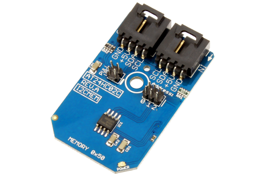

[](https://www.controleverything.com/content/I2C-Memory?sku=AT24HC02C_I2CMEM)
# AT24HC02C
AT24HC02C Memory Sensor

The AT24HC02C device, is a 256-byte serial EEPROM using I²C communications.

This Device is available from ControlEverything.com [SKU: AT24HC02C_I2CMEM]

https://www.controleverything.com/content/I2C-Memory?sku=AT24HC02C_I2CMEM

This Sample code can be used with Raspberry Pi, Arduino, Particle Photon and Beaglebone Black.

## Java
Download and install pi4j library on Raspberry pi. Steps to install pi4j are provided at:

http://pi4j.com/install.html

Download (or git pull) the code in pi.

Compile the java program.
```cpp
$> pi4j AT24HC02C.java
```

Run the java program.
```cpp
$> pi4j AT24HC02C
```

## Python
Download and install smbus library on Raspberry pi. Steps to install smbus are provided at:

https://pypi.python.org/pypi/smbus-cffi/0.5.1

Download (or git pull) the code in pi. Run the program.

```cpp
$> python AT24HC02C.py
```

## Arduino
Download and install Arduino Software (IDE) on your machine. Steps to install Arduino are provided at:

https://www.arduino.cc/en/Main/Software

Download (or git pull) the code and double click the file to run the program.

Compile and upload the code on Arduino IDE and see the output on Serial Monitor.


## Particle Photon

Login to your Photon and setup your device according to steps provided at:

https://docs.particle.io/guide/getting-started/connect/photon/

Download (or git pull) the code. Go to online IDE and copy the code.

https://build.particle.io/build/

Verify and flash the code on your Photon. Code output is shown in logs at dashboard:

https://dashboard.particle.io/user/logs


## C

Download (or git pull) the code in Beaglebone Black.

Compile the c program.
```cpp
$>gcc AT24HC02C.c -o AT24HC02C
```
Run the c program.
```cpp
$>./AT24HC02C
```

#####The code output is the stored value of data.
